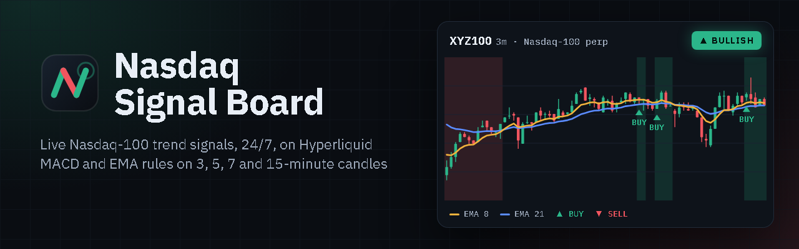

# Nasdaq Signal Board

Live Nasdaq-100 trend signals from Hyperliquid's 24/7 stock perps.

**Open it: https://shyameet.github.io/nasdaq-signal-board/**

Two panels apply the same four rules, each checked every second on the bar still forming:

| Rule | Bullish | Bearish |
|---|---|---|
| 3m | EMA 8 above EMA 21 | EMA 8 below EMA 21 |
| 5m | MACD above 0 | MACD below 0 |
| 7m | MACD above 0 | MACD below 0 |
| 15m | MACD above its signal | MACD below its signal |

All four bullish: BULLISH. All four bearish: BEARISH. Anything else: NEUTRAL. MACD is 12/26/9.

- **NDX10**: the ten largest Nasdaq-100 weights that trade on Hyperliquid, as one composite (official index
  weights rescaled to 100%; 1000 = the 10/05/2026 close).
- **NAS100**: the Nasdaq-100 perp itself, `xyz:XYZ100`, plus a 1m MACD shown for information.

Everything runs in your browser. The page loads two days of 1-minute candles from Hyperliquid's public API,
then follows its live candle stream. There is no server and no account; drawings and settings stay in your
browser.

For information only, not investment advice. An independent project, not affiliated with Nasdaq, Inc.,
Hyperliquid or TradingView.

| File | What it is |
|---|---|
| `index.html` | the Signals page |
| `divergence.html` | the Divergence page: where the two signals disagree, and a scoreboard of what followed |
| `engine.js` | the signal calculation |
| `basket.json` | the NDX10 basket: stocks, weights and reference prices |
| `lightweight-charts.js` | TradingView Lightweight Charts™ 4.2.3 |
| `brand/` | logo, icons, app manifest and the link-preview banner (made by `make_brand.py`) |
| `404.html` | the page for addresses that don't exist |

Charts: [TradingView Lightweight Charts™](https://www.tradingview.com/lightweight-charts/),
Copyright (c) 2025 TradingView, Inc., Apache License 2.0.
